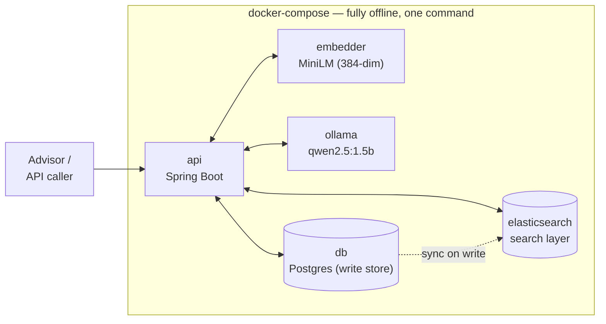
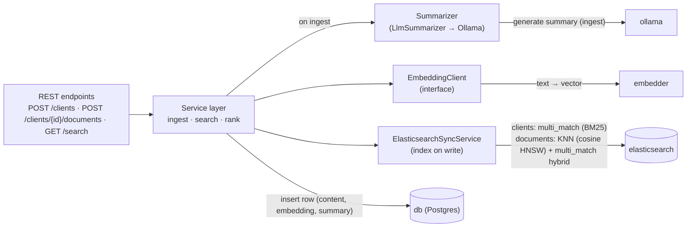
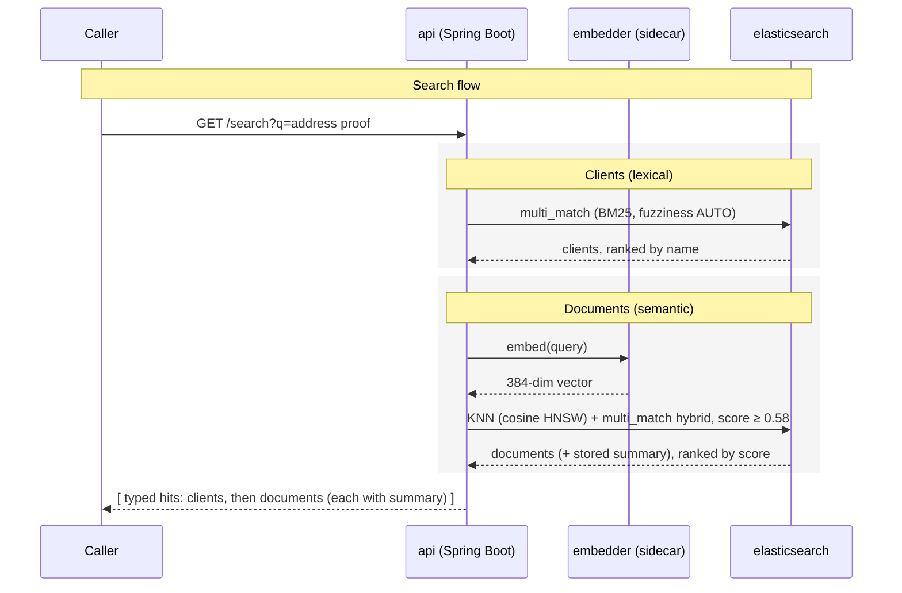
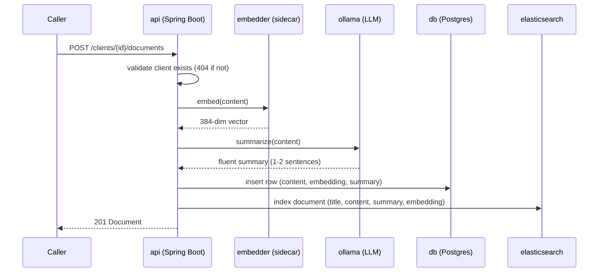
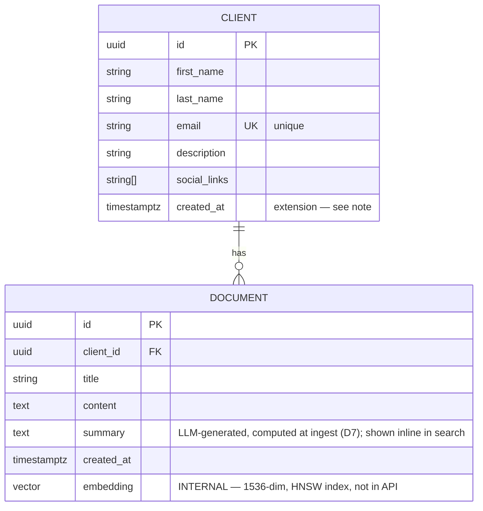

# Design Document — Nevis Search API

> A Search API over **clients** and **documents** for a WealthTech advisor platform.

---

## Architecture at a glance

- **PostgreSQL 16** — source of truth for clients, documents, vectors, and summaries.
- **Elasticsearch 8** — drives all search. Clients are searched via full-text matching; documents use hybrid search (dense vector KNN + BM25 keyword matching).
- **Embeddings** generated at ingest by a local Python sidecar (`all-MiniLM-L6-v2`).
- **Summaries** generated at ingest by a local Ollama model (`qwen2.5:1.5b`).
- **Offline-first** — the whole system runs via `docker compose up`, with no secrets and no external API dependencies.

---

## 1. Problem & Requirements

Advisors need to search across their clients and those clients' documents — and these are two fundamentally different problems.

| # | Requirement | Example | Nature of the problem |
|---|---|---|---|
| R1 | Find **clients** by matches in name / email / description | `"NevisWealth"` → client `john.doe@neviswealth.com` | **Lexical** — substring / token match. Deterministic, cheap. |
| R2 | Find **documents** by *similar terms* in content | `"address proof"` → document containing `"utility bill"` | **Semantic** — no shared words. Needs meaning-based matching. |
| R3 | Quick **summary** of a document's content | utility-bill document → *"Monthly electricity utility bill. Account holder: John Doe."* | Generative summarization via a local LLM. |

Client search is exact-string / lexical matching. Document search is semantic — "address proof" has to match "utility bill" despite sharing zero words, which lexical search alone can't do. Embeddings + vector search is the right tool for R2; each requirement gets the mechanism suited to it rather than forcing one approach onto both.

### Functional scope

- `POST /clients` — create a client.
- `POST /clients/{id}/documents` — add a document to a client (embedded on ingest).
- `GET /search?q=` — unified search returning matching clients *and* documents.
- Each document in the search results carries an LLM-generated **summary** of its content (see D7) — the spec treats summary as a search-response field, not a separate endpoint.

### Non-functional scope & assumptions

**Scale (per requirements):** 1k–10k clients, 10–1k documents per client, documents averaging ~10 KB. These are ranges, not a fixed total — the actual document count (`clients × docs-per-client`) spans two orders of magnitude depending on which ends combine:

| Clients | Docs / client | **Total documents** |
|---|---|---|
| 1,000 (low) | 10 (low) | **~10 K** |
| 1,000 | 1,000 | ~1 M |
| 10,000 | 10 | ~100 K |
| 10,000 (high) | 1,000 (high) | **~10 M** |

So the workload sits anywhere from ~10 K to ~10 M documents. Storage at the bounds:

| Metric | Low end (~10 K docs) | High end (~10 M docs) |
|---|---|---|
| Raw content (~10 KB each) | ~100 MB | **~100 GB** |
| Embeddings (384-dim ≈ 1.5 KB each) | ~15 MB | **~15 GB** |

**Scaling to ~10 M documents:** at that scale, brute-force vector scans aren't viable, so an ANN (Approximate Nearest Neighbor) index is essential. Search is offloaded to Elasticsearch, which gives HNSW indexing for near-`O(log n)` semantic queries and horizontal sharding — avoiding the operational ceiling of scaling `pgvector` on a single Postgres instance. Document search runs as hybrid retrieval in a single ES call: KNN handles semantic intent (e.g. "address proof" → utility bill) while BM25 captures exact keywords (e.g. "John"), with both scores combined automatically.

Two further constraints shape the design throughout:

- **Reproducibility** — `docker compose up` brings up the entire system with no secrets and no external API calls; a reviewer runs it in one command.
- **Simplicity over cleverness** — the simplest correct design is preferred, with production extensions documented rather than built.

---

## 2. Key Design Decisions

### D1 — Language / framework

**Java 21 + Spring Boot + Maven**, using `springdoc-openapi` for REST endpoints and API specs. Search integration wires the official `ElasticsearchClient` (8.14.0) via `RestClientTransport`, configured through `application.yml`.

### D2 — How R2 gets solved: hybrid embeddings + BM25

| Option | Pros | Cons |
|---|---|---|
| Keyword / full-text (Postgres FTS, `tsvector`) | Simple, built-in | Matches tokens, not meaning — "address proof" and "utility bill" share none. Fails R2 outright. |
| Synonym dictionary | No ML dependency | Brittle, unbounded maintenance, misses relations no one thought to encode |
| LLM judges relevance at query time | Very flexible | Slow, costly, non-deterministic, scans all documents — a candidate for future work, not this scale |
| Embeddings + vector search alone | Semantic matching, fast at query time (precomputed), indexable | Solves the core problem, but leaves keyword signals (e.g. an exact name) unused |
| **Hybrid: embeddings + BM25** | Best of both — a query like `"John address proof"` benefits from semantic *and* keyword relevance, combined in a single ES query | Needs a search engine with native hybrid support (ES 8.x has it; pgvector doesn't) |

**Decision: hybrid embeddings + BM25 search via Elasticsearch.** Pure vector similarity satisfies R2, but hybrid search handles the case where a query carries both semantic intent and a keyword signal, scoring both in one request via ES's `knn` + `query`. Replicating that in Postgres would mean two separate queries and manual score merging.

### D3 — Where vectors live: Postgres as write store, Elasticsearch as search layer

| Option | Role | Pros | Cons |
|---|---|---|---|
| **Postgres + `pgvector`** | Write store | One datastore for relational data and vectors — transactional writes, single source of truth | Search layer still needs something purpose-built for hybrid queries |
| **Elasticsearch** | Search layer | Purpose-built search — native HNSW, hybrid KNN + BM25, horizontal sharding | Second system to keep in sync; eventual consistency |
| Dedicated vector DB (Pinecone, Qdrant, Weaviate) | — | Purpose-built for very large-scale vector search | A third system to operate — overkill alongside ES at this scale; a documented scaling path (§7) |
| In-memory / in-app cosine | — | No dependency | Not persistent; O(n) scans |

**Decision:** Postgres is the write store — clients, documents, and embeddings are written there transactionally, and synchronously synced to Elasticsearch on every write. Elasticsearch serves all search queries. This split gives full transactional guarantees on writes, and hybrid KNN + BM25 search, HNSW indexing, and horizontal scalability on reads.

**Tradeoff — eventual consistency:** direct write-through to ES carries drift risk if a crash happens mid-sync. At production scale this would move to a CDC pipeline for decoupled, reliable indexing (see §7).

### D3a — Indexing: ES HNSW for vectors, ES `multi_match` for clients

| Option | Pros | Cons |
|---|---|---|
| **ES HNSW (KNN)** | Native in ES 8.x, high recall, fast queries, shards horizontally | Higher memory than IVFFlat-style indexes |
| `pgvector` HNSW | Stays in Postgres, no extra service | Single-node only; no native hybrid BM25; would need manual score merging for hybrid — and ES is already in the stack |

**Decision: ES HNSW.** Better recall/latency at this target scale, native hybrid scoring, and horizontal sharding. The `dense_vector` field is declared with `dims: 384`, `index: true`, `similarity: cosine` in the ES index mapping.

**Lexical search (clients, R1)** — client search uses ES `multi_match` with `fuzziness: AUTO` across `first_name`, `last_name`, `email`, and `description`, with field boosts (`email^3`, `first_name^2`, `last_name^2`).

| Option | Pros | Cons |
|---|---|---|
| **ES `multi_match` + fuzziness** | Substring + fuzzy matching natively; field boosts rank the best-matching client first; already in the stack; sub-millisecond at 10K clients, scales horizontally | Requires ES (already present for document search anyway) |
| `pg_trgm` GIN index | Handles `ILIKE '%q%'` substring matching, zero extra infrastructure, fuzzy-tolerant, sub-millisecond at 10K–100K clients | No relevance ranking or field boosts; a second search path separate from documents |
| Postgres full-text (`tsvector`) | Built-in relevance ranking, good for word/stem matching | Matches whole tokens/stems, not substrings — misses `"NevisWealth"` inside `…@neviswealth.com`, failing the spec's own example |

**Decision: ES `multi_match`.** Since ES is already in the stack for documents, using it for clients too gives a single unified search layer, with Postgres handling only writes — beats `ILIKE` on substring matching, fuzzy/typo tolerance, and relevance ranking in one query with no leading-`%` scan problem.

### D4 — Embedding model: local, not hosted

| Option | Pros | Cons |
|---|---|---|
| **Local model (`all-MiniLM-L6-v2`, 384-dim)** | No API key, no cost, runs fully offline — `docker compose up` works for a reviewer with zero setup; reproducible | Larger image; rated below top hosted models on public benchmarks, though sufficient for this task |
| Hosted API (e.g. OpenAI `text-embedding-3-small`) | Higher benchmark quality, trivial integration | Requires a secret key, internet access, and billing — reviewer friction and key-leak risk in a public repo; the natural production upgrade (§7) |

**Decision: local model.** Local inference also keeps client PII on-premise, which matters in a WealthTech context. The `EmbeddingClient` interface abstracts the provider so a hosted model can be swapped in later without touching call-sites.

The 384-dimensional vector produced at ingest is stored in Postgres (`pgvector`) as the durable record. At query time, the same model re-embeds the query, and the resulting vector goes directly into the Elasticsearch `knn` clause — no separate vector-store lookup. The KNN search runs entirely inside ES using the HNSW index on the `documents` index.

> **Data-privacy note:** all embedding computation runs inside the `embedder` sidecar container — no text leaves the host. `EmbeddingClient` is the one seam where a hosted model could be introduced, and any such change would need a data-privacy review before production.

### D5 — Where the local model runs

| Option | Pros | Cons |
|---|---|---|
| **Python sidecar container** | `sentence-transformers` is first-class in Python; clean separation; simple HTTP contract; easy to reason about | Additional service in compose |
| In-JVM (ONNX Runtime / DJL) | No extra container | Complex setup, heavier application image, tokenizer/model plumbing in Java — for marginal gain |

**Decision: a small Python embedding service** exposed over HTTP, added to docker-compose. The Java app depends only on the HTTP contract, not the model.

## D6 — `/search` response shape and ranking

The spec defines `/search`'s response as an array, so that's what's returned — a flat array of result items, not a grouped object.

Each item is typed and self-describing: it carries a `type` (`client` | `document`), the matched `entity`, and — for document hits — a `score`. `type` is what lets a caller distinguish clients from documents within the single array.

**Ordering: clients first, then documents — not interleaved by score.** R1 and R2 produce signals on different scales: client matching is lexical (ES `multi_match` / BM25), document matching is a continuous cosine similarity via KNN. These aren't comparable, so sorting the whole array by one score would be misleading. Documents are ranked by ES cosine similarity; clients are ordered deterministically by name (`last_name, first_name`). That's a deliberate choice — for an exact-substring match, every returned client already contains the query, so a BM25 score would mostly reward shorter records rather than better matches. A search result here is scanned to locate a known client, so stable name order is the more honest default. Fuzzy/typo-tolerant client matching (where rows *would* differ in match quality, and a score earns its place) and a blended/normalized cross-type ranking are both natural §7 extensions, not needed here.

Example response:

```json
[
  { "type": "client",
    "entity": { "id": "…", "first_name": "John", "last_name": "Doe",
                "email": "john.doe@neviswealth.com" } },
  { "type": "document", "score": 0.83,
    "entity": { "id": "…", "client_id": "…", "title": "Electricity bill – March",
                "created_at": "2026-07-01T10:00:00Z" } }
]
```

Each type returns the top-N results (N defaults to 20 in this build); full cursor/offset pagination is a §7 item, not required at demo scale.

### D6a — Relevance floor: top-N above a configurable score threshold

Vector search returns the *nearest* documents, not necessarily *relevant* ones — with no cutoff, an unrelated query still surfaces low-scoring noise. The subtlety is that cosine scores are relative, not absolute: a genuinely correct match for a short query can score only modestly, so a floor set too high silently drops real results, including the spec's own worked example.

**Decision:** return the top-N nearest documents whose similarity is at or above a floor (`search.min-score`, default `0.58`), and expose the score in the response. The value is corpus- and model-dependent, so it's a config value, never hardcoded.

### D7 — Document summary (R3)

The spec asks for a "quick summary of document content" and encourages LLM integration.

| Option | Pros | Cons |
|---|---|---|
| Extractive (return representative source sentences) | Hallucination-proof — output is verbatim from the document | Not a true summary — can't paraphrase or condense across sentences; degrades badly on short documents, where picking 2 of 5 sentences is just truncation |
| **Generative — local LLM (Ollama)** | Fluent — paraphrases and condenses into a true summary; fully offline (~1.5GB model, no API key, no internet); demonstrates LLM integration as the spec encourages | Hallucination risk (mitigated below); slower than extractive (~1–3s per document) — acceptable at ingest, not on the query path; one extra container |
| Generative — hosted LLM (e.g. OpenAI) | Highest-quality prose, no local compute needed | Requires a secret key and internet access — breaks the offline/reproducibility guarantee; a documented production option (§7) |

**Decision: generative summarization via a local LLM.** A single `Summarizer` implementation (`LlmSummarizer`) calls a local [Ollama](https://ollama.com/) instance running `qwen2.5:1.5b`, itself a container in Docker Compose — no external API key, fully offline. For documents of this size (~10 KB, typically 5–30 sentences), extractive summarization would reduce to returning near-verbatim content; it can't paraphrase, condense, or produce the fluent summaries advisors expect.

**Hallucination mitigation:** the prompt instructs the model to use only information explicitly stated in the document and not to infer or invent. Combined with low temperature (`0.1`) and a constrained output length (`num_predict: 200`), the model stays grounded in the source material.

**Mechanics:**

- **Computed at ingest** — `POST /clients/{id}/documents` embeds the content and generates the summary in the same call, storing both in Postgres. Both are synced to Elasticsearch; the `summary` field is indexed alongside `title` and `content` and participates in the hybrid `multi_match` boost, so a query matching words in the summary contributes to the document's BM25 score.
- **Model:** `qwen2.5:1.5b` — small enough to run on any developer machine, fast enough for synchronous ingest (~1–3s per document).
- **Prompt:** domain-specific (financial document summarizer), constrained to max 2 sentences, factuality-enforced, third person present tense.

---

## 3. Architecture

Shown at two levels — a system context view (the containers and how they connect) and a component view (what lives inside `api` and how it uses the other services) — followed by a sequence diagram tracing a search request end-to-end.

### 3.1 System context



| Component | Role |
|---|---|
| `api` | REST endpoints, validation, ranking/merge, orchestration |
| `embedder` | Stateless sidecar: text → 384-dim vector (embeds documents on ingest, queries on search) |
| `ollama` | Local LLM: generates fluent document summaries at ingest (D7) |
| `db` | Postgres + pgvector: relational data + vector search (`<=>`) with an HNSW index |
| `elasticsearch` | Search layer: lexical client search (`multi_match`) + semantic document search (KNN / HNSW) |

All five components run as services in a single `docker-compose.yml`; `docker compose up` starts the whole system with no secrets, no API keys, and no external calls — every feature, including LLM-generated summaries, runs offline.

### 3.2 Component view (inside `api`)



The embedding provider sits behind `EmbeddingClient` (local sidecar today, hosted API a natural production swap — see D4/§7). At ingest, `LlmSummarizer` calls Ollama to produce a fluent summary, stored in Postgres alongside the embedding and immediately synced to Elasticsearch via `ElasticsearchSyncService`. Search queries ES directly — no summarization or Postgres lookup at query time. The service layer owns the grouped ranking (D6); the endpoints stay thin.

### 3.3 Search request flow



The two searches run sequentially (clients, then documents). They're independent, so they could run concurrently — Java 21 virtual threads are well suited to the blocking embedder HTTP call, and doing so would cut latency by the embedder round-trip. Kept sequential here: the queries are fast at this scale, and the concurrency isn't worth the added complexity until profiling says otherwise (see §7).

Document hits carry their precomputed summary (D7), read straight from the Elasticsearch document — no Postgres lookup or summarization step in the search path.

### 3.4 Ingest flow (document)



Both derived values — the embedding and the LLM-generated summary — are computed at ingest and stored in both Postgres (source of truth) and Elasticsearch (search index), so search reads them cheaply with no runtime computation.

---

## 4. Data Model

The database schema is a superset of the API schema (§5): it adds one internal column that powers semantic search but is never exposed over the API. Every other field maps directly to the spec's `Client` / `Document` objects.



- **IDs** (`id`, `client_id`) are UUIDs, serialized as strings — satisfies the spec's `type: string` while giving collision-free, client-independent generation.
- **`created_at` on `Client`** is an addition to the spec (which only defines it on `Document`). A creation timestamp is standard and useful, and adding it to both entities removes an asymmetry. Uses `timestamptz` (timezone-aware), matching `Document`.
- **`email`** carries a unique constraint — this both models a real business rule (one client per email) and lets the database reject duplicate-creation races under concurrency, so no application-level locking is needed. Full-text search across `first_name`, `last_name`, `email`, and `description` is delegated entirely to Elasticsearch — Postgres holds no generated column or trigram index for search.
- **`embedding`** is populated on ingest; raw `content` is retained for display and summarization. It's an addition to the spec schema and is never returned in API responses.

---

## 5. API Contract (summary)

| Method | Path | Body / Params | Success | Notes |
|---|---|---|---|---|
| POST | `/clients` | `first_name, last_name, email` (req), `description, social_links` (opt) | `201` Client | `400` on validation error |
| POST | `/clients/{id}/documents` | `title, content` (req) | `201` Document | `404` if client missing |
| GET | `/search` | `q` (req), `client_id` (opt) | `200` flat array of typed hits `{type, score, entity}`; document hits include an inline `summary` | `400` if `q` blank/missing |

Full contract is auto-generated by springdoc from the controllers and DTOs, and served at `/swagger-ui.html` when the app is running (e.g. `http://localhost:8080/swagger-ui.html` for interactive docs; the raw OpenAPI 3 JSON is at `/v3/api-docs`). The static OpenAPI spec is also exported into the repo, so the contract is viewable without running the app.

---

## 6. Testing Strategy

Tests are organized by level, prioritizing the two behaviours the spec calls out.

- **Integration tests (real Postgres + real Elasticsearch)** — the primary suite. Exercise the two spec examples end-to-end through the API: `"NevisWealth"` → the expected client, and `"address proof"` → a document containing `"utility bill"`. Each test runs against live ES indices; `@BeforeEach` drops and recreates both indices, then calls `refreshIndices()` after data setup so queries see a consistent view. Since embeddings are non-deterministic floating-point values, semantic tests assert *relative ranking* (the utility-bill document ranks above an unrelated one) rather than exact scores.
- **Relevance floor test** — verifies that `search.min-score=0.58` correctly suppresses noise, using orthogonal unit vectors (relevant result on axis 0, noise on axis 1) so the KNN cosine similarity is geometrically exact and the assertion doesn't depend on BM25 fluctuations.
- **API / contract tests** — verify REST behaviour and HTTP codes: `201` on create, `400` on validation failure or blank `q`, `404` for a document under a non-existent client.
- **No dedicated unit test layer.** Most of the service layer is thin orchestration over Postgres/Elasticsearch/embedder/Ollama, with little standalone logic to isolate — so behavior is exercised through the integration suite instead of separate mocked unit tests.
- **Summary flow** — `Summarizer` is mocked in integration tests (returns a deterministic string), so tests verify the summary flows through the system without requiring Ollama.
- **Edge cases** — blank/whitespace query, no matches, special characters in `q`, empty document content, duplicate client email (the unique-constraint path).
- **Out of scope** — the embedding model, Elasticsearch internals, and pgvector internals are treated as trusted dependencies and not re-tested.

---

## 7. Production Considerations & Future Work

Intentionally out of scope for this deliverable, but accounted for in the architecture, so each item below is a localized change rather than a redesign.

- **Embedding model upgrade:** swap the local model for a hosted API (e.g. OpenAI `text-embedding-3-small`) behind `EmbeddingClient`. API key injected via environment variable or secret manager — never committed to source control.
- **Scaling to 10M documents:** benchmarked at 100k documents (1,000 clients × 100 documents, bulk-inserted via `dev/benchmark.sh`) — client lexical search averaged 19ms and document semantic search averaged 53ms end-to-end (including embedder round-trip), both measured against the live API. Beyond current scale: batch/async ingestion, paginated results, and HNSW parameter tuning (`num_candidates`, `k`) for the recall/latency tradeoff. `ElasticsearchSyncService` is the seam that keeps the search layer swappable if a dedicated vector store (Qdrant/Weaviate) becomes warranted.
- **Multi-tenant isolation (the first thing I'd add):** advisors must only see their own firm's data; there's no auth today. The isolation boundary is the tenant (the advisory firm), not the individual advisor. Every query would filter by a `tenant_id` from the authenticated token, enforced at the repository layer so a missing filter fails review rather than silently leaking data across firms. In Elasticsearch this is a per-query `term` filter on `tenant_id`, applied before scoring. Auth (API-key or OAuth) sits in front.
- **Operational readiness:** rate limiting, structured request logging, metrics export, health checks, schema migrations (Flyway). Elasticsearch index mappings would move to versioned migration tooling rather than the current recreate-on-boot approach.
- **Resilience:** HTTP calls to `embedder` and `ollama` run under timeouts (5s and 30s respectively); Postgres failures are bounded by connection-pool timeouts and max pool size. Remote-call failures surface as HTTP 503 with a descriptive message. A circuit breaker (e.g. Resilience4j) is worth adding as traffic or the number of remote dependencies grows — deliberately omitted here as over-engineering for this scope.
- **Partial search results:** if the embedder is down, `/search` currently fails entirely (503) even though client lexical search would have succeeded independently. A more resilient design would return partial results (clients only) with a degradation signal — a natural addition once there's monitoring to detect and alert on the degraded state.
- **Concurrency:** request concurrency is handled by Spring's servlet thread pool; the service layer is stateless, so there's no shared mutable state to guard. Write correctness is enforced at the database — the unique constraint on `email` resolves duplicate-creation races, Postgres MVCC handles concurrent inserts — and throughput is bounded by the HikariCP connection pool. Two places could use intra-request parallelism: bulk ingestion at ~10M documents (async/batched embedding, with the stateless `embedder` scaling to multiple replicas), and the two independent halves of `/search`, which could run concurrently on virtual threads to hide the embedder round-trip.
- **Search quality:** hybrid ranking (BM25 lexical + KNN semantic, combined via Elasticsearch's reciprocal-rank fusion) is already in place. Natural next steps: typo tolerance beyond `fuzziness: AUTO` (e.g. phonetic analysis), per-field boosting tuned on real query logs, cross-encoder reranking for precision at the top of the result list. ES also supports query-time synonyms and custom analyzers, all localized to the index mapping and query DSL without touching application code.
- **Reindex endpoint:** an `/admin/reindex` endpoint (triggering `ElasticsearchIndexService.reindexAll()`) would allow recovery from index corruption or mapping changes without redeployment. The service method already exists; exposing it behind an authenticated admin route is a small addition.
- **Search interface & scope:** the spec defines `GET /search?q=` as global — both worked examples (client discovery, document similarity) are shown with no client scoping, and client search *must* stay global since it's how a caller finds a client they can't yet identify. The spec leaves the meaning of `q` open; it's defined here as free-text search terms, with any scoping expressed as separate parameters rather than overloading `q`. Natural extensions grounded in the advisor workflow:
  - **Client-scoped document search** — an optional `client_id` filter, since document lookups in wealth management are usually per-client (e.g. fetching a specific client's proof of address for KYC). Global stays the default to honour the spec's contract and examples.
  - **Client-centric result mode** — "which clients have a document matching X?" (e.g. a compliance sweep: who has proof of address on file, who's missing one). `document.client_id` already supports this; it would become a result-grouping mode or a dedicated endpoint.
  - **Structured queries** — `q` could grow a lightweight filter syntax later; kept as plain text here to avoid a hand-rolled parser the spec doesn't require.

---

## 8. Requirements Clarifications

Clarifications obtained from the Nevis team that informed the design:

1. **Test data:** self-seeded — realistic sample clients and documents are generated as part of the deliverable.
2. **Scale:** 1k–10k clients, 10–1k documents each, ~10 KB per document, spanning ~10K–10M documents total (see §1). The design targets the ~10M upper bound, which drove the ANN-index decision (D3a) and the scaling considerations in §7.

Beyond these two, other product ambiguities — relevance definition, PII handling, multi-tenancy — were resolved as documented assumptions rather than a further clarification round (see D4 for the privacy posture, §7 for tenant isolation), in keeping with the intent of testing decision-making under ambiguity.

---

## 9. Known Limitations & Accepted Tradeoffs

What the system does *not* do, and why — each a conscious tradeoff, not an oversight.

1. **Embedding truncation.** The embedder model has a fixed context window; for long documents, only the first portion is semantically indexed. Accepted because financial documents typically front-load key information (title, amounts, parties), and switching to a longer-context model is a one-line config change behind `EmbeddingClient`.
2. **No partial results on service failure.** If the embedder is down, `/search` returns 503 even though client lexical search could succeed independently. Omitted to keep the error model simple and testable; a production system would return partial results with a degradation signal.
3. **Synchronous ingest.** Document creation embeds + summarizes within the HTTP request (~1–3s total). At bulk-import scale this would move to an async pipeline (queue + worker); the current design is correct for interactive use and keeps the code simple.
4. **No circuit breaker.** Timeouts guard against hung external services, but there's no circuit breaker to fast-fail after repeated downstream errors — worth adding as traffic and dependency count grow, deliberately omitted as over-engineering here.
5. **Document format.** The spec models `content` as plain text, so the API assumes documents arrive as already-extracted text; real formats (PDFs, scans) would need an upstream extraction/OCR step, out of scope here. Document *category* (utility bill, bank statement) is deliberately not a stored field — semantic search matches on meaning, so "address proof" finds a utility bill without anyone tagging documents by type.
6. **Ingest degrades by dependency criticality.** The embedding is required — without a vector, a document is invisible to semantic search, a silent data-integrity hole — so an embedder failure fails the write (503) and persists nothing. The summary is enrichment (R3, optional): a summarizer failure stores the document with a `null` summary rather than failing ingest, since a non-critical dependency shouldn't block a core operation. The summary can be backfilled later. Both calls run outside any transaction, so no DB connection is held across network I/O.
7. **Near-real-time index visibility.** Elasticsearch refreshes indices roughly every second by default — a document written and immediately queried within that window may not yet appear. In production this is a known ~1s lag, not a bug; integration tests call `refreshIndices()` explicitly to bypass it.
8. **ES sync is best-effort after Postgres commit.** If the Elasticsearch index call fails after Postgres has committed, the record exists in the source of truth but is invisible to search until the index is repaired. There's no distributed transaction across the two stores — accepted because Postgres is authoritative and `reindexAll()` can recover full consistency at any time.
