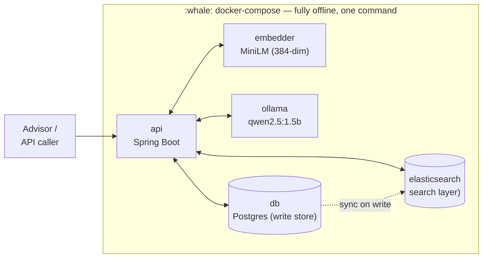
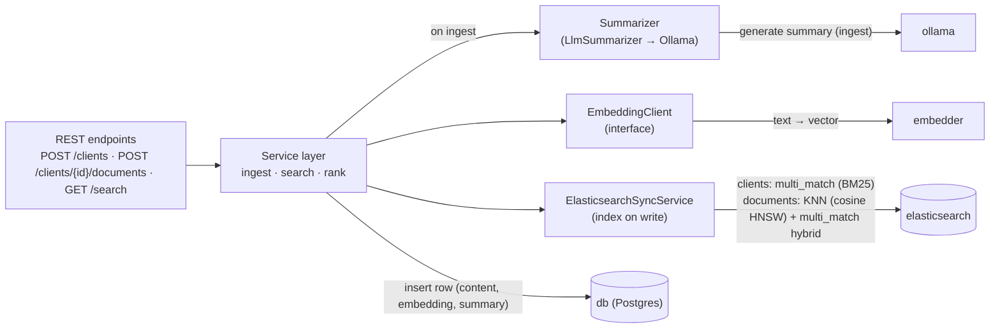
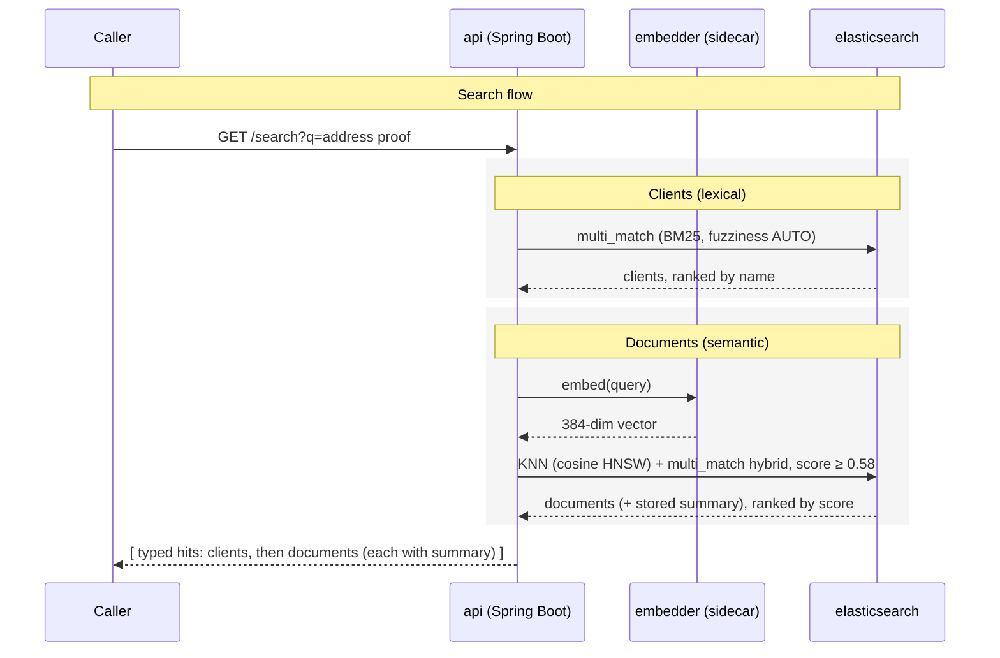
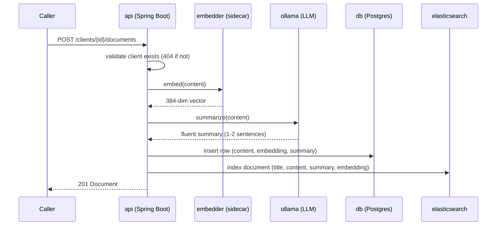
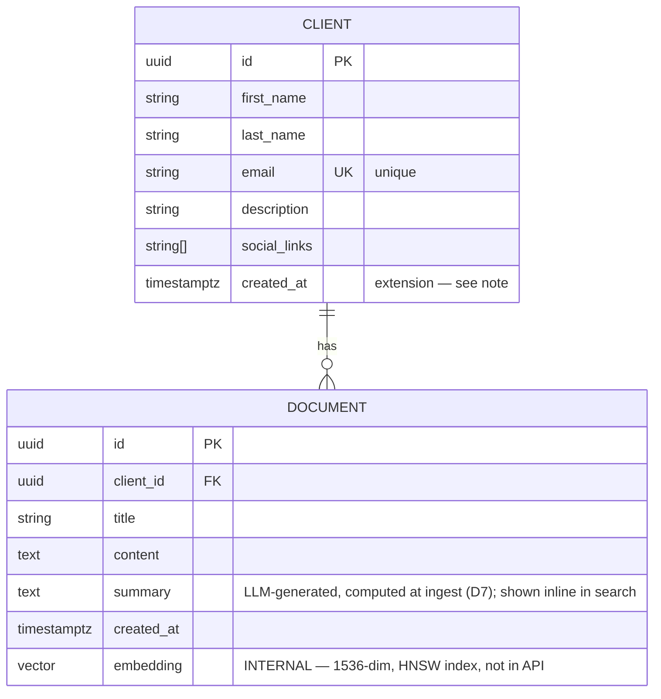

# Design Document — Nevis Search API

> A Search API over **clients** and **documents** for a WealthTech advisor platform.
> This document captures the design reasoning prior to implementation: the requirements,
> the options considered at each decision point, the tradeoffs, and the resulting
> architecture.

---

## TL;DR — Architecture at a glance

A single **Postgres 16** instance stores clients, documents, embeddings (`pgvector`), and
summaries. Client search is **lexical** (substring ILIKE backed by a `pg_trgm` trigram
index); document search is **semantic** (cosine similarity over 384-dim embeddings, HNSW
indexed). Embeddings are generated at ingest by a Python sidecar (`all-MiniLM-L6-v2`);
summaries are generated by a local **Ollama** LLM (`qwen2.5:1.5b`). The system is designed
for **up to ~10M documents** and runs fully offline via `docker compose up` — no API keys,
no external services. The sharpest accepted tradeoff: `all-MiniLM-L6-v2` truncates input
at ~256 tokens, so only the first ~500 words of a 10KB document are semantically indexed —
acceptable for this deliverable, documented below as a known limitation.

---

## 1. Problem & Requirements

Advisors need to search across their clients and those clients' documents. Two search
behaviours are required, and they are **fundamentally different problems**:


| #   | Requirement                                               | Example                                                                                 | Nature of the problem                                                |
| --- | --------------------------------------------------------- | --------------------------------------------------------------------------------------- | -------------------------------------------------------------------- |
| R1  | Find **clients** by matches in name / email / description | `"NevisWealth"` → client `john.doe@neviswealth.com`                                     | **Lexical** — substring / token match. Deterministic, cheap.         |
| R2  | Find **documents** by *similar terms* in content          | `"address proof"` → document containing `"utility bill"`                                | **Semantic** — no shared words. Needs meaning-based matching.        |
| R3  | Quick **summary** of a document's content                 | utility-bill document → *"Monthly electricity utility bill. Account holder: John Doe."* | Generative summarization — local LLM produces fluent summaries (D7). |


**Key insight driving the design:** "search" here is really *two different problems*.
Client search (R1) is exact string matching; document search (R2) is **semantic** —
"address proof" must match "utility bill" despite zero shared words, which lexical search
can't. Embeddings + vector search is the right fit for R2 (alternatives weighed in D2); the
design uses the appropriate mechanism for each rather than forcing one.

### Functional scope

- `POST /clients` — create a client.
- `POST /clients/{id}/documents` — add a document to a client (embedded on ingest).
- `GET /search?q=` — unified search returning matching clients *and* documents.
- Each document in the search results carries an LLM-generated **summary** of its content (D7)
— the spec lists summary as a *search case*, not a separate endpoint.

### Non-functional scope & assumptions

- **Scale (per requirements):** **1k–10k clients**, **10–1k documents per client**,
documents averaging **~10 KB**. These are *ranges*, not a total — the total document
count is `clients × docs-per-client`, so it spans two orders of magnitude depending on
which ends combine:

  | Clients       | Docs / client | **Total documents** |
  | ------------- | ------------- | ------------------- |
  | 1,000 (low)   | 10 (low)      | **~10 K**           |
  | 1,000         | 1,000         | ~1 M                |
  | 10,000        | 10            | ~100 K              |
  | 10,000 (high) | 1,000 (high)  | **~10 M**           |

  So the workload is anywhere from **~10 K to ~10 M documents**. Derived storage at the
  bounds:

  | Metric                             | Low end (~10 K docs) | High end (~10 M docs) |
  | ---------------------------------- | -------------------- | --------------------- |
  | Raw content (~10 KB each)          | ~100 MB              | **~100 GB**           |
  | Embeddings (384-dim ≈ 1.5 KB each) | ~15 MB               | **~15 GB**            |

  **We design for the upper bound (~10 M documents).** 
  The range crosses the threshold where the design changes: at ~10K a brute-force vector scan is acceptable, but at ~10M it is too slow and an ANN index becomes necessary. 
  Elasticsearch's native KNN search uses HNSW (Hierarchical Navigable Small World) as its ANN index — queries run in O(log n) rather than O(n), and the index shards horizontally across ES nodes in a way that pgvector on a single Postgres instance cannot match without significant operational complexity. Document search uses hybrid KNN + BM25 in a single ES query: the KNN component handles semantic similarity ("address proof" → utility bill), while BM25 handles keyword relevance ("John" → documents mentioning John) — ES combines both scores automatically.
  Two consequences are therefore promoted from "future work" into the core design:
  (1) semantic search requires an ANN index — satisfied here by ES HNSW (see D3a); 
  (2) document ingestion must be batchable/async at volume — a synchronous write-through to ES is acceptable at dev scale but would need a CDC pipeline (e.g. Debezium + Kafka) at 10M records to avoid blocking writes and handle failure recovery. We build the index and seed a realistic (smaller) sample locally, then document how the design holds to ~10M (§7).

Two further constraints shape every decision below:

- **Reproducibility:** `docker compose up` must bring up the entire system with **no
secrets and no external API calls** — a reviewer runs it in one command.
- **Simplicity over cleverness:** we prefer the simplest correct design and document
where we would extend it for production.

---

## 2. Key Design Decisions (options & tradeoffs)

### D1 — Language / framework

**Decision: Java 21 + Spring Boot + Maven** — the stack I build most robustly in, and a strong fit for the problem: mature REST/validation/JPA, auto-generated OpenAPI via springdoc, and Testcontainers for integration testing. The **Elasticsearch Java client (**`elasticsearch-java:8.14.0`**)** integrates naturally into the Spring Boot dependency injection model — `ElasticsearchClient` is wired as a Spring bean via `RestClientTransport`, reading the ES URL from `application.yml` with no framework magic or auto-configuration surprises. Python and Kotlin were equally valid; Python pairs naturally with the embedding model, which is why that component runs as a separate Python service (D5) — each ecosystem is used where it is strongest.

### D2 — How to satisfy R2 (document search by *similar terms*)

The options below span the naive baseline through to the chosen approach; the baseline is
included to show *why* semantic matching is necessary rather than assumed.


| Option                             | How                                                             | Pros                                                                                                           | Cons                                                                                            | Verdict                       |
| ---------------------------------- | --------------------------------------------------------------- | -------------------------------------------------------------------------------------------------------------- | ----------------------------------------------------------------------------------------------- | ----------------------------- |
| Keyword / full-text (baseline)     | Postgres FTS, `tsvector`                                        | Simple, built-in                                                                                               | Matches tokens, not meaning — "address proof" and "utility bill" share none                     | Rejected — fails R2           |
| Synonym dictionary                 | Hand-maintained term expansion                                  | No ML dependency                                                                                               | Brittle, unbounded maintenance, misses unseen relations                                         | Rejected                      |
| LLM judges relevance at query time | Send query + candidate docs to an LLM per request               | Very flexible                                                                                                  | Slow, costly, non-deterministic, scans all docs                                                 | Rejected — viable future work |
| **Embeddings + vector search**     | Embed content on ingest; embed query; rank by cosine similarity | Semantic matching; fast at query time (precomputed); indexable                                                 | Needs an embedding model + vector store                                                         | **Superseded**                |
| **Hybrid: Embeddings + BM25** ✅    | KNN vector search + keyword scoring combined in a single query  | Best of both worlds — semantic *and* keyword relevance; a query like `"John address proof"` benefits from both | Requires a search engine that supports hybrid queries natively (ES 8.x does; pgvector does not) | **Chosen**                    |


**Decision: hybrid embeddings + BM25 via Elasticsearch.** Pure vector similarity satisfies R2, but hybrid search is strictly better — it handles the case where a query contains both semantic intent ("address proof") and keyword signals ("John"), combining both scores in a single ES query without a second round-trip. Elasticsearch 8.x supports this natively via `knn` + `query` in one request; replicating it in Postgres would require two separate queries and manual score merging. The embedding model (`all-MiniLM-L6-v2`) runs as a Python sidecar (D5) and is invoked at both ingest time and query time — keeping the Java service stateless with respect to ML.

### D3 — Where to store vectors


| Option                                           | Pros                                                                                           | Cons                                                                     | Verdict                                     |
| ------------------------------------------------ | ---------------------------------------------------------------------------------------------- | ------------------------------------------------------------------------ | ------------------------------------------- |
| **Postgres +** `pgvector`                        | One datastore for relational data *and* vectors → transactional writes, single source of truth | Extension setup; search layer needs a separate engine for hybrid queries | **Chosen as write store**                   |
| **Elasticsearch** ✅                              | Purpose-built search — native HNSW, hybrid KNN + BM25, horizontal sharding                     | Second system to keep in sync; eventual consistency                      | **Chosen as search layer**                  |
| Dedicated vector DB (Pinecone, Qdrant, Weaviate) | Purpose-built for very large-scale vector search                                               | Third system to operate; overkill alongside ES                           | Rejected (documented as scaling path in §7) |
| In-memory / in-app cosine                        | No dependency                                                                                  | Not persistent; O(n) scans                                               | Rejected                                    |


**Decision: Postgres as the write store (source of truth) + Elasticsearch as the search layer.** Clients, documents, and embeddings are written to Postgres transactionally; on every write they are synchronously synced to ES, which serves all search queries. This separation gives us: (1) full transactional guarantees on writes via Postgres; (2) hybrid KNN + BM25 search, HNSW indexing, and horizontal scalability via ES — none of which pgvector alone can provide at ~10M documents without significant operational complexity. *(Validated: a hybrid KNN + BM25 query correctly ranked "utility bill" nearest to an "address proof" query, with scores clearly differentiated from noise.)*  

The accepted tradeoff is **eventual consistency** — a crash between the Postgres write and the ES sync leaves ES stale. At this scale, synchronous write-through is acceptable. The production evolution is a CDC pipeline (Debezium + Kafka) that guarantees delivery — documented in §7.

### D3a — Indexing (both search paths must stay fast at scale)

Each search path needs its own index, for a different reason.

**Vector search (documents, R2).** A brute-force scan is O(n) — fine for the seed set, far too slow at 10M rows. Elasticsearch uses HNSW as its ANN index for KNN queries:


| Option              | Pros                                                             | Cons                                                              | Verdict                                 |
| ------------------- | ---------------------------------------------------------------- | ----------------------------------------------------------------- | --------------------------------------- |
| **ES HNSW (KNN)** ✅ | Native in ES 8.x; high recall; fast queries; shards horizontally | Higher memory than IVFFlat                                        | **Chosen**                              |
| pgvector HNSW       | Stays in Postgres; no extra service                              | Single-node only; no hybrid BM25; manual score merging for hybrid | Superseded — ES is already in the stack |
| pgvector HNSW       | Lower memory                                                     | Needs tuning; lower recall; same single-node limitation           | Rejected                                |


**Decision: ES HNSW** — better recall/latency at the target scale, native hybrid scoring with BM25, and horizontal sharding. The `dense_vector` field is declared with `dims: 384`, `index: true`, `similarity: cosine` in the ES index mapping.  

**Lexical search (clients, R1).** Client search uses ES `multi_match` with `fuzziness: AUTO` across `first_name`, `last_name`, `email`, and `description` with field boosts (`email^3`, `first_name^2`, `last_name^2`). This is strictly better than Postgres ILIKE — it handles substring matching, fuzzy/typo tolerance, and relevance ranking in a single query, with no leading-`%` scan problem.

**Alternatives considered for R1 (client lexical search):**


| Option                                 | Pros                                                                                                                                                                                                                                 | Cons                                                                                                                                                        | Verdict                                                                 |
| -------------------------------------- | ------------------------------------------------------------------------------------------------------------------------------------------------------------------------------------------------------------------------------------ | ----------------------------------------------------------------------------------------------------------------------------------------------------------- | ----------------------------------------------------------------------- |
| **ES** `multi_match` **+ fuzziness** ✅ | 1) Handles substring + fuzzy matching natively. 2) Field boosts (`email^3`, `first_name^2`) rank the most relevant client first. 3) Already in the stack — no extra service. 4) Sub-millisecond at 10K clients, scales horizontally. | Requires ES (already present for document search)                                                                                                           | **Chosen**                                                              |
| `pg_trgm` GIN index                    | 1) Handles `ILIKE '%q%'` substring matching natively. 2) Zero infrastructure overhead — lives in Postgres. 3) Supports fuzzy/typo-tolerant matching. 4) Sub-millisecond at 10K–100K clients.                                         | 1) No relevance ranking or field boosts. 2) Separate from document search layer — two search paths, two systems.                                            | Superseded — ES is already in the stack and does more                   |
| Postgres full-text (`tsvector`)        | 1) Built-in relevance ranking (BM25-like). 2) Good for word/stem matching.                                                                                                                                                           | 1) Matches whole tokens/stems, **not substrings** — misses `"NevisWealth"` inside `…@neviswealth.com`. 2) Requires maintaining `tsvector` column + trigger. | Rejected — fails the spec's substring example                           |
| Elasticsearch / OpenSearch             | 1) Best-in-class full-text search. 2) Rich query DSL (fuzzy, wildcard, phrase).                                                                                                                                                      | Without pgvector, loses transactional write guarantees and requires a dedicated vector store too.                                                           | Rejected as sole datastore — correct as search layer alongside Postgres |


**Decision: ES** `multi_match` — since ES is already in the stack for document search, using it for client search too eliminates the need for a `pg_trgm` index entirely. The result is a single unified search layer (ES) serving both search paths, with Postgres handling only writes.

### D4 — Embedding model: local vs hosted


| Option                                            | Pros                                                                                                             | Cons                                                                                                        | Verdict                                                      |
| ------------------------------------------------- | ---------------------------------------------------------------------------------------------------------------- | ----------------------------------------------------------------------------------------------------------- | ------------------------------------------------------------ |
| **Local model** (`all-MiniLM-L6-v2`, 384-dim) ✅   | No API key, no cost, **runs offline** → `docker compose up` works for the reviewer with zero setup; reproducible | Larger image; generally rated below top hosted models on public benchmarks, though sufficient for this task | **Chosen**                                                   |
| Hosted API (e.g. OpenAI `text-embedding-3-small`) | Higher benchmark quality; trivial integration                                                                    | Requires secret key + internet + billing; reviewer friction; risk of a leaked key in a public repo          | Rejected for the deliverable; **recommended for production** |


### Decision — **Local model** (`all-MiniLM-L6-v2`, 384-dim)

Local inference keeps client PII on-premise, which is a hard requirement for a WealthTech context. The `EmbeddingClient` interface abstracts the provider, so other option can be swapped in without touching call-sites.  

The 384-dimensional vector produced at ingest time is stored in Postgres (`pgvector`) as the durable record. At query time the same model re-embeds the user's query and the resulting vector is passed directly to the Elasticsearch `knn` clause — no separate vector store lookup is needed. The KNN search happens entirely inside ES using the HNSW index on the `documents` index.  

> **Data-privacy note:** all embedding computation runs inside the `embedder` sidecar container. No text leaves the host. The `EmbeddingClient` interface is the only seam where a hosted model could be introduced; any such change must go through a data-privacy review before reaching production.

### D5 — Where the local model runs


| Option                         | Pros                                                                                                                      | Cons                                                                       | Verdict                               |
| ------------------------------ | ------------------------------------------------------------------------------------------------------------------------- | -------------------------------------------------------------------------- | ------------------------------------- |
| **Python sidecar container** ✅ | `sentence-transformers` is first-class in Python; clean separation; simple HTTP contract; straightforward to reason about | Additional service in compose                                              | **Chosen**                            |
| In-JVM (ONNX Runtime / DJL)    | No extra container                                                                                                        | Complex setup; heavier application image; tokenizer/model plumbing in Java | Rejected (higher risk, marginal gain) |


**Decision: a small Python embedding service** exposed over HTTP, added to  
docker-compose. The Java app depends only on the HTTP contract, not the model.

## D6 — /search response shape and ranking

The spec defines the `/search` response as an **array**. We return exactly that — a flat array of result items — rather than a grouped object, to match the contract.  

**Each item is *typed and self-describing*:** it carries a `type` (`client` | `document`), the matched `entity`, and — for document hits — a `score`. The `type` field is what lets a caller distinguish clients from documents within the single array.  

**Ordering — clients first, then documents; NOT interleaved by score.** R1 and R2 produce signals on different scales: client matching is lexical (Elasticsearch `multi_match` with BM25) while document matching is a continuous cosine similarity via KNN. These are not comparable, so sorting the whole array by one `score` would be misleading. We therefore order by *type* — clients then documents — with **documents ranked by ES cosine similarity** and **clients ordered deterministically by name** (`last_name, first_name`). Name order is deliberate: for an exact-substring match every returned client already contains the query, so BM25 score would mostly reward shorter records rather than better matches — a search result is scanned to locate a known client, for which stable name order is the more honest default. Fuzzy/typo-tolerant client matching (where rows *would* differ in match quality, and a score earns its place) is a §7 extension, as is a blended/normalized cross-type ranking (§7, hybrid ranking).  

Example response:  

```
[
  { "type": "client",
    "entity": { "id": "…", "first_name": "John", "last_name": "Doe",
                "email": "john.doe@neviswealth.com" } },
  { "type": "document", "score": 0.83,
    "entity": { "id": "…", "client_id": "…", "title": "Electricity bill – March",
                "created_at": "2026-07-01T10:00:00Z" } }
]
```

Each type returns the **top-N** results (N is a fixed default of 20 in this build); full cursor/offset pagination is deferred to §7 as it is not required at the demo scale.  

### D6a — Relevance: top-N above a configurable score floor, score exposed

Vector search returns the *nearest* documents, not necessarily *relevant* ones — with no cutoff, an unrelated query still surfaces low-scoring noise. The subtlety is that **cosine scores are relative, not absolute**: a genuinely correct match for a short query scores only modestly, so a floor set too high silently drops real results, including the spec's own example.  

**Decision: return the top-N nearest documents whose similarity is at or above a floor (**`search.min-score`**, default 0.58), and expose the** `score`**.** Two observations make a floor the right call rather than returning raw nearest-neighbours:

- **There is a usable gap for this corpus/model.** Measured on the seeded data, genuine matches for the spec query cluster at ~0.60 (utility bill 0.602, council tax 0.596) while unrelated documents sit at ~0.499 and below — Elasticsearch's cosine HNSW scores have a higher noise floor than raw pgvector cosine. A floor of **0.58** lands cleanly in that gap: it removes obvious noise without touching either spec example. Returning noise below the floor would make the result *look* less relevant than it is.
- **The value is corpus- and model-dependent, so it must not be hardcoded.** This is exactly why it is externalized to `search.min-score` (env `SEARCH_MIN_SCORE`), not a magic constant — the operator re-tunes it when the corpus or embedding model changes, and it can be set to `0` to disable filtering entirely (the test profile does this to assert ranking independently).

Because the score is still returned, the caller retains full information (0.602 vs 0.499) and can apply its own stricter cutoff. A **relative** floor (keep results within a gap of the top score) is a natural refinement noted in §7, for corpora where a single absolute value generalizes poorly.

### D7 — Document summary (R3)

The spec asks for a "quick summary of document content" and encourages LLM integration.

**D7a — Generative vs. extractive.**


| Option                                                | Pros                                                                                                                                                                                                                 | Cons                                                                                                                                                                                                                               | Verdict                      |
| ----------------------------------------------------- | -------------------------------------------------------------------------------------------------------------------------------------------------------------------------------------------------------------------- | ---------------------------------------------------------------------------------------------------------------------------------------------------------------------------------------------------------------------------------- | ---------------------------- |
| Extractive (return representative *source* sentences) | 1) Hallucination-proof — output is verbatim from the document.                                                                                                                                                       | 1) Not a true summary — just picks a few sentences from the document; can't paraphrase or condense across sentences. 2) Degrades on short documents — selecting 2 of 5 sentences is truncation, not summarization.                 | Rejected                     |
| **Generative — local LLM (Ollama)** ✅                 | 1) Fluent — can paraphrase and condense across sentences into a true summary. 2) Fully offline — no API key, no internet; small model (~1.5GB) runs locally. 3) Demonstrates LLM integration as the spec encourages. | 1) Hallucination risk — mitigated by factuality-focused prompt + low temperature. 2) Slower (~1-3s per document vs near-instant) — acceptable at ingest, not on the query path. 3) Larger compose footprint — one extra container. | **Chosen**                   |
| Generative — hosted LLM (e.g. OpenAI)                 | 1) Highest quality prose — state-of-the-art models. 2) No local compute needed.                                                                                                                                      | 1) Requires secret key + internet + billing. 2) Breaks the offline/reproducibility guarantee — reviewer can't run without credentials.                                                                                             | Documented production option |


**Decision: generative via local LLM.** A single `Summarizer` implementation (`LlmSummarizer`) calls a local [Ollama](https://ollama.com/) instance running `qwen2.5:1.5b`. Ollama runs as a container in Docker Compose — no external API key, fully offline.  

**Why not extractive?** For the document sizes in this domain (~10 KB, typically 5–30 sentences), extractive summarization reduces to returning near-verbatim content — it cannot paraphrase, condense across sentences, or produce the fluent summaries advisors expect. A generative approach produces genuinely useful, readable summaries while the factuality-focused prompt mitigates hallucination risk.  

**Hallucination mitigation.** The prompt instructs the model: *"Use only information explicitly stated in the document — do not infer or invent."* Combined with low temperature (0.1) and a constrained output length (`num_predict: 200`), the model stays grounded in the source material.  

**Where it lives — inline in search, computed at ingest.** The spec lists "quick summary of document content" as one of the *search cases* and defines no separate endpoint, so the summary is a **field on each document in the search results**, not a standalone route. Like the embedding, it is a derived value computed **once at ingest and stored** (a `summary` column in Postgres), so search reads it cheaply — no summarization work at query time.  

**Mechanics.**  

- **Computed at ingest:** `POST /clients/{id}/documents` embeds the content *and* generates the summary in the same call, storing both in Postgres. On startup, both are synced to Elasticsearch — the `summary` field is indexed alongside `title` and `content` and participates in the hybrid `multi_match` boost, so a query matching words in the summary contributes to the document's BM25 score.
- **Model:** `qwen2.5:1.5b` — small enough to run on any developer machine, fast enough for synchronous ingest (~1–3 s per document).
- **Prompt:** domain-specific (financial document summarizer), constrained to max 2 sentences, factuality-enforced, third person present tense.
- **No fallback:** Ollama is a required dependency in Docker Compose (started before the API via healthcheck + `depends_on`). If the LLM is unreachable, that is a deployment issue — not masked by a degraded fallback.

---

## 3. Architecture

The architecture is shown at two levels: a **system context** view (the containers and how they connect) and a **component** view (what lives inside the `api` and how it uses the other services). A sequence diagram then traces a search request end-to-end.

### 3.1 System context




| Component     | Role                                                                                        |
| ------------- | ------------------------------------------------------------------------------------------- |
| `api`         | REST endpoints, validation, ranking/merge, orchestration                                    |
| `embedder`    | Stateless sidecar: text → 384-dim vector (embeds documents on ingest, queries on search)    |
| `ollama`      | Local LLM: generates fluent document summaries at ingest (D7)                               |
| `db`          | Postgres + pgvector: relational data + vector search (`<=>`) with an HNSW index             |
| elasticsearch | Search layer: lexical client search (`multi_match`) + semantic document search (KNN / HNSW) |


All five components run as services in a single `docker-compose.yml`; `docker compose up` starts the whole system with **no secrets, no API keys, and no external calls** — every feature, including LLM-generated summaries (D7), runs offline.

### 3.2 Component view (inside `api`)




The embedding provider sits behind `EmbeddingClient` (local sidecar today, hosted API in production — D4/§7). At **ingest**, the `Summarizer` (`LlmSummarizer`) calls Ollama to produce a fluent summary, which is stored in Postgres alongside the embedding and immediately synced to Elasticsearch via `ElasticsearchSyncService`; **search** queries ES directly — no summarization or Postgres lookup at query time. The service layer owns the grouped ranking (D6); the endpoints stay thin.

### 3.3 Search request flow




The two searches run sequentially (clients, then documents). They are independent, so they could run concurrently — with Java 21 virtual threads, well-suited to the blocking embedder HTTP call — to cut latency by the embedder round-trip. Kept sequential here: the queries are fast at this scale, and the saving isn't worth the added concurrency complexity until latency profiling justifies it (noted in §7).  

Document hits carry their **precomputed summary** (D7) — read straight from the Elasticsearch document, so the search flow needs no Postgres lookup or summarization step.  

3.4 Ingest flow (document)




Both derived values — the embedding and the LLM-generated summary — are computed at ingest and stored in both Postgres (source of truth) and Elasticsearch (search index), so search reads them cheaply with no runtime computation.

---

## 4. Data Model

This is the **database** schema, which is a superset of the API schema (§5): it adds one column that powers semantic search but is never exposed over the API, marked `INTERNAL` below. Every other field maps directly to the spec's `Client` / `Document` objects.




- **IDs** (`id`, `client_id`) are UUIDs, serialized as strings — this satisfies the spec's `type: string` while providing collision-free, client-independent generation.
- `created_at` **on** `Client` is an addition to the spec (which defines `created_at` on `Document` only). A creation timestamp is standard and useful, and the spec invites extending the model where needed; adding it to both entities removes an asymmetry and is returned in the client response. Uses `timestamptz` (timezone-aware) — see `Document`.
- `email` carries a **unique constraint** — this both models a real business rule (one client per email) and lets the database reject duplicate-creation races under concurrency, so no application-level locking is needed. Full-text search across `first_name`, `last_name`, `email`, and `description` is delegated entirely to Elasticsearch (`multi_match` + `matchPhrasePrefix` + `wildcard`) — Postgres holds no generated column or trigram index for search.
- `embedding` is populated on ingest; the raw `content` is retained for display and the optional summary. It is an addition to the spec schema (the spec invites extending the model where needed) and is never returned in API responses.

---

## 5. API Contract (summary)


| Method | Path                      | Body / Params                                                           | Success                                                                                           | Notes                      |
| ------ | ------------------------- | ----------------------------------------------------------------------- | ------------------------------------------------------------------------------------------------- | -------------------------- |
| POST   | `/clients`                | `first_name, last_name, email` (req), `description, social_links` (opt) | `201` Client                                                                                      | `400` on validation error  |
| POST   | `/clients/{id}/documents` | `title, content` (req)                                                  | `201` Document                                                                                    | `404` if client missing    |
| GET    | `/search`                 | `q` (req), `client_id` (opt)                                            | `200` flat array of typed hits `{type, score, entity}`; document hits include an inline `summary` | `400` if `q` blank/missing |


Full contract is auto-generated by **springdoc** from the controllers and DTOs, and served
at `/swagger-ui.html` when the app is running (e.g. `http://localhost:8080/swagger-ui.html`
for interactive docs; the raw OpenAPI 3 JSON is at `/v3/api-docs`). The static OpenAPI spec
is also exported into the repo so the contract is viewable without running the app.

---

## 6. Testing Strategy

Tests are organized by level, prioritizing the two behaviours the spec calls out.

- **Integration tests (real Postgres + real Elasticsearch)** — the primary suite. Exercise the two spec examples end-to-end through the API: `"NevisWealth"` → the expected client, and `"address proof"` → a document containing `"utility bill"`. Each test runs against live ES indices; `@BeforeEach` drops and recreates both indices (correct mappings, zero documents), then calls `refreshIndices()` after data setup so queries see a consistent view. Because embeddings are non-deterministic floating-point values, semantic tests assert **relative ranking** (the utility-bill document ranks above an unrelated document) rather than exact scores.
- **Relevance floor test** — verifies that the `min-score` threshold (`search.min-score=0.58`) correctly suppresses noise. Uses orthogonal unit vectors (relevant result on axis 0, noise on axis 1) so the KNN cosine similarity is geometrically exact and the assertion is robust regardless of BM25 fluctuations.
- **API / contract tests** — verify REST behaviour and correct HTTP codes: `201` on create, `400` on validation failure or blank `q`, `404` for a document under a non-existent client. (The spec explicitly requires proper HTTP codes.)
- **Unit tests** — the pieces with isolated logic: result ranking/grouping, and the service layer with the `EmbeddingClient` and `Summarizer` **mocked** so tests are fast and independent of the model / LLM.
- **Summary** — the `Summarizer` is mocked in integration tests (returns a deterministic string), so tests verify the summary flows through the system without requiring Ollama.
- **Edge cases** — blank/whitespace query, no matches, special characters in `q`, empty document content, and duplicate client email (the unique-constraint path).
- **Out of scope** — the embedding model, Elasticsearch internals, and pgvector internals are treated as trusted dependencies and not re-tested.

---

## 7. Production Considerations & Future Work

The following items are intentionally out of scope for this deliverable but are accounted for in the architecture — the boundaries are drawn so each enhancement is a localized change rather than a redesign.  

- **Embedding model upgrade:** swap the local model for a hosted API (e.g. OpenAI `text-embedding-3-small`) behind the `EmbeddingClient` interface. API key injected via environment variable or secret manager — never committed to source control.
- **Scaling to 10 M documents:** Elasticsearch's HNSW index handles large-scale KNN retrieval natively. Benchmarked at 100k documents (1000 clients × 100 documents, bulk-inserted via `dev/benchmark.sh`): client lexical search averaged **19 ms** and document semantic search averaged **53 ms** end-to-end (including embedder round-trip), both measured against the live API. Beyond the current scale — **batch/async ingestion** (embed documents in bulk rather than one-per-request), paginated results, and HNSW parameter tuning (`num_candidates`, `k`) for the recall/latency tradeoff. The `ElasticsearchSyncService` boundary keeps the search layer swappable if a dedicated vector store (Qdrant/Weaviate) becomes warranted at the upper range.
- **Multi-tenant isolation (the first thing I'd add).** Advisors must only see their own firm's data; today there is no auth. The isolation boundary is the **tenant** (the advisory firm), not the individual advisor. Every query would filter by a `tenant_id` taken from the authenticated token, enforced at the repository layer so a missing filter fails review rather than silently leaking data across firms. In Elasticsearch this is a per-query `term` filter on a `tenant_id` field, applied before scoring. Auth (API-key or OAuth) sits in front.
- **Operational readiness:** rate limiting, structured request logging, metrics export, health checks, and schema migrations (Flyway). Elasticsearch index mappings would also be managed via versioned migration tooling (e.g. a startup migration service) rather than the current recreate-on-boot approach.
- **Resilience:** the HTTP calls to the `embedder` and `ollama` run under timeouts (5s and 30s respectively); Postgres failures are bounded by the connection-pool timeouts and max pool size. Both remote-call failures surface as HTTP 503 to the caller with a descriptive message. A full circuit breaker (e.g. Resilience4j) on the remote calls is a production-hardening step worth adding as the number of remote dependencies or traffic grows — deliberately omitted here as over-engineering for the deliverable's scope.
- **Partial search results:** if the embedder is down, the entire `/search` call currently fails (503) even though the client lexical search (ES `multi_match` + `matchPhrasePrefix`) succeeded independently. A more resilient design would return partial results (clients only) with a degradation signal in the response — a natural enhancement once the system has monitoring to detect and alert on the degraded state.
- **Concurrency:** request concurrency is handled by Spring's servlet thread pool; the service layer is stateless, so there is no shared mutable state to guard. Write correctness is enforced at the database — the unique constraint on `email` resolves duplicate-creation races, and Postgres MVCC handles concurrent inserts — and throughput is bounded by the HikariCP connection pool. Two places could use intra-request parallelism: bulk ingestion at ~10 M documents (async/batched embedding, above), where the stateless `embedder` scales to multiple replicas; and the two independent halves of `/search` (client lexical + document semantic), which could run concurrently on Java 21 virtual threads to hide the embedder round-trip — kept sequential here as the saving isn't worth the added complexity at this scale.
- **Search quality:** hybrid ranking is already implemented (BM25 lexical + KNN semantic, combined by Elasticsearch's reciprocal-rank fusion). Natural next steps: typo tolerance beyond `fuzziness: AUTO` (e.g. phonetic analysis), per-field boosting tuned on real query logs, and cross-encoder reranking for precision at the top of the result list. Elasticsearch also supports query-time synonyms and custom analyzers — all localized to the index mapping and query DSL without touching application code.
- **Reindex endpoint:** an `/admin/reindex` endpoint (triggering `ElasticsearchIndexService.reindexAll()`) would allow recovery from index corruption or mapping changes without redeployment. The service method already exists; exposing it behind an authenticated admin route is a small addition.
- **Search interface & scope:** the spec defines `GET /search?q=` as global (both worked examples — client discovery and document similarity — are shown with no client scoping), and client search *must* be global since it finds a client the caller can't yet identify. The spec leaves the *meaning* of `q` to us; we define it as free-text search terms and express any scoping as separate parameters rather than overloading `q`. Natural extensions grounded in the advisor workflow:
  - **Client-scoped document search** — an optional `client_id` filter, since document lookups in wealth management are usually per-client (e.g. fetching a specific client's proof of address for KYC). Global stays the default to honour the spec's contract and examples.
  - **Client-centric result mode** — "which clients have a document matching *X*?" (e.g. a compliance sweep: who has proof of address on file, or who is missing one). The spec's example returns *documents*; returning the owning *clients* surfaced via their documents is a compelling advisor-facing variant. The `document.client_id` link already supports it; it would be a result-grouping mode or a dedicated endpoint.
  - **Structured queries** — `q` could later grow a lightweight filter syntax; kept as plain text here to avoid a hand-rolled parser the spec does not require.

---

## 8. Requirements Clarifications

The following clarifications were obtained from the Nevis team and informed the design:

1. **Test data:** self-seeded. Realistic sample clients and documents are generated as
  part of the deliverable.
2. **Scale:** 1k–10k clients, 10–1k documents each, ~10 KB per document. Multiplied out,
  the total spans ~10 K–10 M documents (see §1). The design targets the ~10 M upper
   bound, which drove the ANN-index decision (D3a) and the scaling considerations in §7.

Beyond these two answered questions, other product ambiguities — relevance definition, PII
handling, multi-tenancy — were resolved as documented assumptions rather than a further
clarification round (see D4 for the privacy posture and §7 for tenant isolation), in keeping
with the take-home's intent to test decision-making under ambiguity.

---

## 9. Known Limitations & Accepted Tradeoffs

 Documenting what the system does *not* do and why — each is a conscious tradeoff, not an oversight.  

1. **Embedding truncation.** The embedder model has a fixed context window; for long documents only the first portion is semantically indexed. Accepted because: (a) financial documents typically front-load key information (title, amounts, parties), (b) switching to a longer-context model (e.g. a hosted API with 8K+ context) is a one-line config change behind the `EmbeddingClient` interface.
2. **No partial results on service failure.** If the embedder is down, `/search` returns 503 even though client lexical search (ES `multi_match` + `matchPhrasePrefix`) could succeed independently. A production system would return partial results with a degradation signal. Omitted here to keep the error model simple and testable.
3. **Synchronous ingest.** Document creation embeds + summarizes in the HTTP request (~1–3s total). At bulk-import scale (thousands of documents) this would be moved to an async pipeline (queue + worker). The current design is correct for interactive use and keeps the code simple.
4. **No circuit breaker.** Timeouts protect against hung external services, but there is no circuit breaker (e.g. Resilience4j) to fast-fail after repeated downstream errors. Worth adding when traffic and number of external dependencies grow — deliberately omitted as over-engineering for this scope.
5. **Document format.** The spec models `content` as a plain-text string, so the API assumes documents arrive as already-extracted text; real formats (PDFs, scans) would need an upstream extraction/OCR step, deliberately out of scope. Document *category* (utility bill, bank statement) is intentionally not a stored field — semantic search matches on meaning, so `address proof` finds a utility bill without anyone having to tag each document by type.
6. **Ingest degrades by dependency criticality.** Document creation calls two services, treated differently by how critical each is to the result. The **embedding is required** — without a vector the document is invisible to semantic search, a silent data-integrity hole — so an embedder failure fails the write (503) and persists nothing. The **summary is enrichment** (R3, optional): a summarizer (Ollama) failure stores the document with a `null` summary rather than failing ingest, so a non-critical dependency cannot block a core operation. The summary can be backfilled later. Both HTTP calls run outside any transaction, so no DB connection is held across network I/O.
7. **Near-real-time index visibility.** Elasticsearch refreshes its indices approximately every second by default — a document written and immediately queried within that window may not appear in results. In production this is a known ~1s lag, not a bug. The integration tests call `refreshIndices()` explicitly after data setup to bypass it; application code accepts the lag as appropriate for this use case.
8. **ES sync is best-effort after Postgres commit.** If the Elasticsearch index call fails after Postgres has committed a write, the record exists in the source of truth but is invisible to search until the index is repaired. There is no distributed transaction across the two stores — accepted because Postgres is authoritative and a reindex operation (`ElasticsearchIndexService.reindexAll()`) can recover full consistency at any time.

